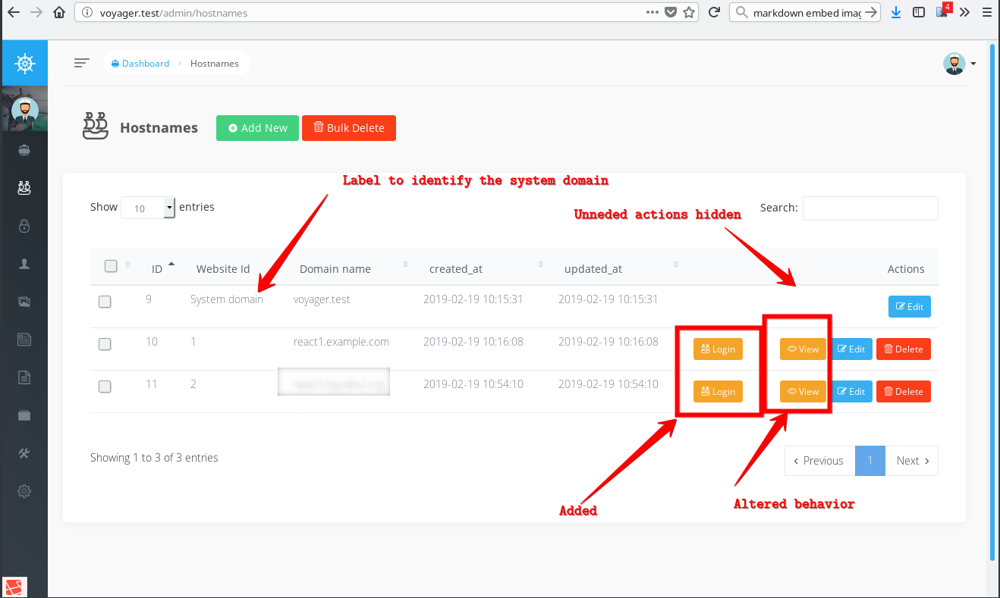

- [Laravel Multitenant + Voyager installation guide](#laravel-multitenant--voyager-installation-guide)
  - [Intro](#intro)
  - [Assumptions](#assumptions)
    - [Voyager](#voyager)
    - [Domain](#domain)
      - [Adding test domains for local development](#adding-test-domains-for-local-development)
  - [Installation](#installation)
    - [Create a fresh install of Laravel 5.7](#create-a-fresh-install-of-laravel-57)
    - [`hyn/multi-tenant` installation](#hynmulti-tenant-installation)
      - [Setup your database](#setup-your-database)
      - [Update Laravel database connection configuration](#update-laravel-database-connection-configuration)
      - [Install `hyn/multi-tenant` package](#install-hynmulti-tenant-package)
      - [Configure `hyn/multi-tenant` (Optional)](#configure-hynmulti-tenant-optional)
    - [Voyager installation](#voyager-installation)
      - [Ideology](#ideology)
      - [Prepare Voyager installation](#prepare-voyager-installation)
        - [Disable auto-discovery for Voyager](#disable-auto-discovery-for-voyager)
      - [Install Voyager composer package](#install-voyager-composer-package)
      - [Register VoyagerServiceProvier](#register-voyagerserviceprovier)
      - [Register Voyager Install command](#register-voyager-install-command)
      - [Make laravel tenancy switch to tenants and register Voyager custom commands](#make-laravel-tenancy-switch-to-tenants-and-register-voyager-custom-commands)
      - [Override Hyn Laravel tenancy Mediacontroller](#override-hyn-laravel-tenancy-mediacontroller)
      - [Add App/Tenant.php - tenant CRUD commands](#add-apptenantphp---tenant-crud-commands)
      - [Prepare sytem Voyager to manage tenants](#prepare-sytem-voyager-to-manage-tenants)
        - [Create `Hostname` model for system Voyager Bread](#create-hostname-model-for-system-voyager-bread)
        - [Create a system domain seeder and run it](#create-a-system-domain-seeder-and-run-it)
      - [Install system Voyager](#install-system-voyager)
      - [Override DefaultPasswordGenerator class of voyager (MySQL only)](#override-defaultpasswordgenerator-class-of-voyager-mysql-only)
      - [Setup system Voyager logic and data to manage tenants](#setup-system-voyager-logic-and-data-to-manage-tenants)
        - [Create custom controller](#create-custom-controller)
        - [Create Bread for hostnames in system Voyager](#create-bread-for-hostnames-in-system-voyager)
        - [Implementing custom Voyager actions and System domain label](#implementing-custom-voyager-actions-and-system-domain-label)
        - [Override a Voyager template to show 'System domain' text for a system domain in system Voyager](#override-a-voyager-template-to-show-system-domain-text-for-a-system-domain-in-system-voyager)
        - [Prepare tenant migrations](#prepare-tenant-migrations)
  - [Check results](#check-results)
  - [Resources](#resources)
# Laravel Multitenant + Voyager installation guide

## Intro

What we will:

* Install [laravel-tenancy.com](https://laravel-tenancy.com/) and [Voyager admin panel](https://laravelvoyager.com/)
both per-tenant and as a system instance.

What we will get:

* System Voyager instane to create tenants.
* Per-tenant Voyager panel.

A short [youtube video](https://www.youtube.com/watch?v=otQfaxCdn7I&feature=youtu.be) of what result we expect.

## Assumptions

### Voyager

You have basic understanding how Voyager works, including Bread Voyager conception.

### Domain

You have at least two domains pointing to your server IP - system domain and one or more tentant (sub)domains.

We will use `voyager.test` to be the system domain for the tutorial.

A tenant domain will look like `kyiv.voyager.test`. It's not a must to be a subdomain.

#### Adding test domains for local development

Edit you `hosts` file to add test domains.

* Linux/MacOS: Edit /etc/hosts
* Windows: https://www.google.com/search?q=windows+hosts+file+path&ie=utf-8&oe=utf-8&client=firefox-b

Add lines like the following ones (at least the 1st and the 2nd lines)  to your hosts file.

```bash
127.0.0.1 voyager.test
127.0.0.1 kyiv.voyager.test
127.0.0.1 dnipro.voyager.test
127.0.0.1 lviv.voyager.test
127.0.0.1 odesa.voyager.test
127.0.0.1 poltava.voyager.test
```

## Installation

### Create a fresh install of Laravel 5.7

If you have installed the Laravel Terminal Installer run:

```bash
laravel new app
```

Got to laravel folder `$ cd app`

Update your `.env` file to use your system domain.

E.g.

```env
APP_URL="http://voyager.text;
```

### `hyn/multi-tenant` installation

#### Setup your database

Follow [Installation - Elevated database user](installation#elevated-database-user) section and setup your database but do edit `config/database.php` as described below.

Under `connections` section

* For `MySQL` change `connections.mysql` key to `connections.system`
* For `Postgres` change `connections.pgsql` key to `connections.system`

`config/database.php`

```php
return [
    /* ... */
    'connections' => [

        /* ... */
        'mysql' => [ // <---- for Mysql change here to 'system'
            'driver' => 'mysql',
            /* ... */
        ],

        'pgsql' => [ // <---- for Postgres change here to 'system'
            'driver' => 'pgsql',
            /* ... */
        ],
    /* ... */
```

#### Update Laravel database connection configuration

Edit your `.env` file and set database connection according to your database server settings.

This can look like for `postgres`

```env
DB_CONNECTION=system
DB_HOST=127.0.0.1
DB_PORT=5432
DB_DATABASE=tenancy
DB_USERNAME=tenancy
DB_PASSWORD=someRandomPassword
```

or `mysql`

```env
DB_CONNECTION=system
DB_HOST=127.0.0.1
DB_PORT=3306
DB_DATABASE=tenancy
DB_USERNAME=tenancy
DB_PASSWORD=someRandomPassword
LIMIT_UUID_LENGTH_32=true
```

Here `DB_CONNECTION=system` is a must.

For MySQL `LIMIT_UUID_LENGTH_32=true` is a must.

#### Install `hyn/multi-tenant` package

```bash
composer require "hyn/multi-tenant"
php artisan vendor:publish --tag=tenancy
php artisan migrate --database=system
```

By now you'd see database tables created in your system database.

#### Configure `hyn/multi-tenant` (Optional)

Open and read carefully `config/tenancy.php`. It's self explaining.

Some options can be configures inside the file.

E.g. you can change `'auto-delete-tenant-directory' => false` to `'auto-delete-tenant-directory' => true`

Some options can be configures via `.env` file.

E.g. you may add to your `.env` file something like this

```env
# Laravel-tenancy config
TENANCY_DATABASE_AUTO_DELETE=true
TENANCY_DATABASE_AUTO_DELETE_USER=true
TENANCY_ABORT_WITHOUT_HOSTNAME=true
```

### Voyager installation

#### Ideology

Multitenantcy assumes, that we, depending on the requested domain,
switch database connection, file system and partially code base
(if there are per tenant overrides) to the proper tenant
or system tenant.

Below we will take care of the switching to tennant flow.

And will create some logic dedicated to the system tenant Voyager instance. It will care of managing tenants from the system Voyager.

#### Prepare Voyager installation

##### Disable auto-discovery for Voyager

Laravel composer auto-discover loads some Voyager logic prior to your
project `AppServiceProvider` is loaded and switched to the
corresponding tenant.

So we need to load `VoyagerServiceProvider` after our `AppServiceProvider`.

In `composer.json` add `tcg/voyager` to `dont-disover` array:
"extra": {
    "laravel": {
        "dont-discover": [
            "tcg/voyager"
        ]
    }
},

#### Install Voyager composer package

```bash
composer require tcg/voyager
```

#### Register VoyagerServiceProvier

Add `TCG\Voyager\VoyagerServiceProvider::class` to `config/app.php` providers array.

#### Register Voyager Install command

Register Voyager install command to `app/Console/Kernel.php`. It will be needed to create tenants via system Voyager.

```bash
    protected $commands = [
        \TCG\Voyager\Commands\InstallCommand::class,
        //
    ];
```

#### Make laravel tenancy switch to tenants and register Voyager custom commands

Update your `app/Providers/AppServiceProvider.php`

So here we do the following:

* Check currently requested domain and if it's not the system one, switch database and filesystem to tenant.
* If we are on the system tenant, then override some Voyager
actions with custom ones. More on this later.

You will see some code referencies not implemented yet. It will be done later.

```php
<?php

namespace App\Providers;

use Hyn\Tenancy\Environment;
use TCG\Voyager\Facades\Voyager;
use App\Actions\TenantViewAction;
use App\Actions\TenantLoginAction;
use App\Actions\TenantDeleteAction;
use TCG\Voyager\Actions\ViewAction;
use TCG\Voyager\Actions\DeleteAction;
use Illuminate\Support\ServiceProvider;

class AppServiceProvider extends ServiceProvider
{
    /**
     * Bootstrap any application services.
     *
     * @return void
     */
    public function boot()
    {
        $env = app(Environment::class);

        $isSystem = true;

        if ($fqdn = optional($env->hostname())->fqdn) {
            if (\App\Tenant::getRootFqdn() !== $fqdn ) {
                config(['database.default' => 'tenant']);
                config(['voyager.storage.disk' => 'tenant']);
                $isSystem = false;
            }
        }

        if ($isSystem) {
            Voyager::addAction(TenantLoginAction::class);
            Voyager::replaceAction(ViewAction::class, TenantViewAction::class);
            Voyager::replaceAction(DeleteAction::class, TenantDeleteAction::class);
        }
        //
    }

    /**
     * Register any application services.
     *
     * @return void
     */
    public function register()
    {
        //
    }
}
```

#### Override Hyn Laravel tenancy Mediacontroller

Hyn forces to use `media` subfolder to store files.
E,g, `storage/app/public/media/image.jpg`

Voyager reads root folder, e.g. `storage/app/public/image.jpg`

So when switched to a tenant Hyn would force Voyager to look
for a file in e.g.
`storage/app/tenancy/tenants/TENANT_UUID/media/image.jpg`
while the uploaded by Voyager file would be placed in fact to
`storage/app/tenancy/tenants/TENANT_UUID/image.jpg`

To fix this we override core `HynOverrideMediaController` to remove that nasty `media` subfolder.

So we create our own controller.

```php
<?php

namespace App\Http\Controllers;

use Hyn\Tenancy\Website\Directory;
use Illuminate\Support\Facades\Storage;

/**
 * Class MediaController
 *
 * @use Route::get('/storage/{path}', App\MediaController::class)
 *          ->where('path', '.+')
 *          ->name('tenant.media');
 */
class HynOverrideMediaController extends \Hyn\Tenancy\Controllers\MediaController
{
    /**
     * @var Directory
     */
    private $directory;

    public function __construct(Directory $directory)
    {
        $this->directory = $directory;
    }

    public function __invoke(string $path)
    {
        // $path = "media/$path";

        if ($this->directory->exists($path)) {
            return response($this->directory->get($path))
                ->header('Content-Type', Storage::disk('tenant')->mimeType($path));
        }

        return abort(404);
    }
}
```

Set all paths requesting Voyager media files to use the just created controller.

Add to  `routes/web.php`

```php
Route::get('/storage/{path}', '\App\Http\Controllers\HynOverrideMediaController')
    ->where('path', '.+')
    ->name('tenant.media');
```

#### Add App/Tenant.php - tenant CRUD commands

Create file `app/Tenant.php` with the conten below.

This file, among other, will provide us with logic to create and
delete tenants.

So on creating a tenant we will run Voyager installation to establish
per-tenant Voyager database and files structure.

We will also take care of some files copied by Voyager install command
(which is not aware it's run as a tenant) to the system filesystem.

The class below provides `getRootFqdn()` method used in various places to get the system domnain name.

```php
<?php

namespace App;

use Hyn\Tenancy\Environment;
use Hyn\Tenancy\Models\Hostname;
use Hyn\Tenancy\Models\Website;
use Illuminate\Support\Facades\Hash;
use Hyn\Tenancy\Contracts\Repositories\HostnameRepository;
use Hyn\Tenancy\Contracts\Repositories\WebsiteRepository;

/**
 * @property Website website
 * @property Hostname hostname
 * @property User admin
 */
class Tenant
{
    public function __construct(Website $website = null, Hostname $hostname = null, User $admin = null)
    {
        $this->website = $website;
        $this->hostname = $hostname;
        $this->admin = $admin;
    }

    public static function getRootFqdn()
    {
        return Hostname::where('website_id', null)->first()->fqdn;
    }

    public static function delete($name)
    {
        // $baseUrl = env('APP_URL_BASE');
        // $name = "{$name}.{$baseUrl}";
        if ($tenant = Hostname::where('fqdn', $name)->firstOrFail()) {
            app(HostnameRepository::class)->delete($tenant, true);
            app(WebsiteRepository::class)->delete($tenant->website, true);
            return "Tenant {$name} successfully deleted.";
        }
    }

    public static function deleteById($id)
    {
        if ($tenant = Hostname::where('id', $id)->firstOrFail()) {
            app(HostnameRepository::class)->delete($tenant, true);
            app(WebsiteRepository::class)->delete($tenant->website, true);
            return "Tenant with id {$id} successfully deleted.";
        }
    }

    public static function deleteByFqdn($fqdn)
    {
        if ($tenant = Hostname::where('fqdn', $fqdn)->firstOrFail()) {
            app(HostnameRepository::class)->delete($tenant, true);
            app(WebsiteRepository::class)->delete($tenant->website, true);
            return "Tenant {$fqdn} successfully deleted.";
        }
    }

    public static function registerTenant($name, $email = null, $password = null): Tenant
    {
        // Convert all to lowercase
        $name = strtolower($name);
        $email = strtolower($email);

        $website = new Website;
        app(WebsiteRepository::class)->create($website);

        // associate the website with a hostname
        $hostname = new Hostname;
        // $baseUrl = env('APP_URL_BASE', 'localhost');
        // $hostname->fqdn = "{$name}.{$baseUrl}";
        $hostname->fqdn = $name;
        app(HostnameRepository::class)->attach($hostname, $website);

        // make hostname current
        app(Environment::class)->tenant($hostname->website);

        // We rename temporary tenant migrations to avoid creating system tenant tables in the tenant database
        $migrations = getcwd() . '/database/migrations/';
        $files_to_preserve = glob($migrations . '*.php');

        foreach ($files_to_preserve as $file) {
            rename($file, $file . '.txt');
        }

        // \Artisan::call('voyager:install');
        \Artisan::call('config:clear');
        \Artisan::call('voyager:install', ['--with-dummy' => true ]);
        //\Artisan::call('passport:install');

        foreach ($files_to_preserve as $file) {
            rename($file.'.txt', $file);
        }

        // Cleanup Voyager dummy migrations from system migration folder
        $voyager_migrations = getcwd() . '/vendor/tcg/voyager/publishable/database/migrations/*.php';
        $files_to_kill = glob($voyager_migrations);
        $files_to_kill = array_map('basename', $files_to_kill);

        foreach ($files_to_kill as $file) {
            $path = $migrations. '/'. $file;
            unlink($path);
        }

        // Make the registered user the default Admin of the site.
        $admin = null;
        if ($email) {
            $admin = static::makeAdmin($name, $email, $password);
        }

        return new Tenant($website, $hostname, $admin);
    }

    private static function makeAdmin($name, $email, $password): User
    {
        $admin = User::create(['name' => $name, 'email' => $email, 'password' => Hash::make($password)]);
        // $admin->guard_name = 'web';
        $admin->setRole('admin')->save();

        return $admin;
    }

    public static function tenantExists($name)
    {
        // $name = $name . '.' . env('APP_URL_BASE');
        return Hostname::where('fqdn', $name)->exists();
    }
}
```

#### Prepare sytem Voyager to manage tenants

##### Create `Hostname` model for system Voyager Bread

```bash
php artisan make:model Hostname
```

##### Create a system domain seeder and run it

To run system Voyager at the system domain we must add it to the
`hostnames` table without any reference to a tenant.

Create file `database/seeds/HostnamesTableSeeder.php`.

Don't forget to replace `voyager.test` with your system domain if needed.

```php
<?php

use App\Hostname;
use Illuminate\Database\Seeder;

class HostnamesTableSeeder extends Seeder
{
    /**
     * Auto generated seed file.
     */
    /**
     * Auto generated seed file.
     *
     * @return void
     */
    public function run()
    {
        $hostname = Hostname::firstOrNew(['fqdn' => 'voyager.test']);

        if (!$hostname->exists) {
            $hostname->fill([
                    'fqdn' => 'voyager.test',
                ])->save();
        }
    }
}
```

Run the seeder.

```bash
composer dump-autoload
php artisan db:seed --class=HostnamesTableSeeder
```

#### Install system Voyager

We need dummy data to have some fallback data for tenants.

> If you don't need dummy data for tenants, install without it here
and update the corresponding command in `app/Tenant.php`.

```bash
php artisan voyager:install --with-dummy
```

#### Override DefaultPasswordGenerator class of voyager (MySQL only)

MySQL is looking for a hard password which have special char also in it.

Voyager use MD5 which just have a-z and 0-9.

Creat file

`app/DatabasePasswordGenerator.php`

```php
<?php 

namespace App;

use Hyn\Tenancy\Generators\Database\DefaultPasswordGenerator;
use Hyn\Tenancy\Contracts\Website;
use Illuminate\Contracts\Foundation\Application;

class DatabasePasswordGenerator extends DefaultPasswordGenerator
{
  /**
   * @var Application
   */
  protected $app;
  
  public function __construct(Application $app)
  {
      $this->app = $app;
  }
  
  public function generate(Website $website) : string
  {
        return crypt(sprintf(
            '%s.%d',
            $this->app['config']->get('app.key'),
            $website->id
        ), '$1$rasmusle$');
  }
}
```

Register it in `config/tenancy.php`

Replace

```php
'password-generator' => Hyn\Tenancy\Generators\Database\DefaultPasswordGenerator::class,
```

with

```php
'password-generator' => App\DatabasePasswordGenerator::class,
```

#### Setup system Voyager logic and data to manage tenants

##### Create custom controller

Create `app/Http/Controllers/VoyagerTenantsController.php`

On performing CRUD operations to `hostnames` table the controller
adds to regular Voyager logic our tenant CRUD logic stored in `app/Tenant.php`

The controller will do some other things worth of mentioning:

* It will fire our methods only for the tenant managerment logic.
See `if (!$this->isTenantOperation($request)) { ...`
* On update system tenant domain it will redirect to the new url.

Examine the code and compare corresponding methods to the core `\TCG\Voyager\Http\Controllers\VoyagerBaseController` controller.

```php
<?php

namespace App\Http\Controllers;

use App\Tenant;
use Hyn\Tenancy\Environment;
use Illuminate\Http\Request;
use Hyn\Tenancy\Models\Hostname;
use TCG\Voyager\Facades\Voyager;
use Illuminate\Support\Facades\DB;
use TCG\Voyager\Events\BreadDataAdded;
use TCG\Voyager\Events\BreadDataDeleted;


class VoyagerTenantsController extends \TCG\Voyager\Http\Controllers\VoyagerBaseController
{
    /**
     * Check if current request is an add of a tenant
     *
     * @param \Illuminate\Http\Request $request
     *
     * @return bool
     */
    private function isTenantOperation(Request $request) {
        $slug = $this->getSlug($request);

        $env = app(Environment::class);
        $fqdn = optional($env->hostname())->fqdn;

        if (\App\Tenant::getRootFqdn() !== $fqdn || 'hostnames' !== $slug) {
            return false;
        }

        return true;
    }

    /**
     * POST BRE(A)D - Store data.
     *
     * @param \Illuminate\Http\Request $request
     *
     * @return \Illuminate\Http\RedirectResponse
     */
    public function store(Request $request)
    {
        if (!$this->isTenantOperation($request)) {
            return parent::store($request);
        }

        $fqdn = $request->get('fqdn');
        $request->offsetSet('fqdn', $fqdn);


        $slug = $this->getSlug($request);

        $dataType = Voyager::model('DataType')->where('slug', '=', $slug)->first();

        // Check permission
        $this->authorize('add', app($dataType->model_name));

        // Validate fields with ajax
        $val = $this->validateBread($request->all(), $dataType->addRows);

        if ($val->fails()) {
            return response()->json(['errors' => $val->messages()]);
        }

        if (!$request->has('_validate')) {

            $tenant = Tenant::registerTenant($fqdn);

            $data = Hostname::where('fqdn', $fqdn)->firstOrFail();

            // $data = $this->insertUpdateData($request, $slug, $dataType->addRows, new $dataType->model_name());

            event(new BreadDataAdded($dataType, $data));

            if ($request->ajax()) {
                return response()->json(['success' => true, 'data' => $data]);
            }

            return redirect()
                ->route("voyager.{$dataType->slug}.index")
                ->with([
                        'message'    => __('voyager::generic.successfully_added_new')." {$dataType->display_name_singular}",
                        'alert-type' => 'success',
                    ]);
        }
    }

    //***************************************
    //                _____
    //               |  __ \
    //               | |  | |
    //               | |  | |
    //               | |__| |
    //               |_____/
    //
    //         Delete an item BREA(D)
    //
    //****************************************

    public function destroy(Request $request, $id)
    {
        if (!$this->isTenantOperation($request)) {
            return parent::destroy($request);
        }

        $slug = $this->getSlug($request);

        $dataType = Voyager::model('DataType')->where('slug', '=', $slug)->first();

        $fqdn = Hostname::where('id', $id)->firstOrFail(['fqdn'])->fqdn;
        $systemSite = \App\Tenant::getRootFqdn();

        if ( $systemSite === $fqdn ) {
            return redirect()
                ->route("voyager.{$dataType->slug}.index")
                ->with([
                        'message'    => __('voyager::generic.system.site.cannot.be.deleted'),
                        'alert-type' => 'error',
                    ]);
        }

        // Check permission
        $this->authorize('delete', app($dataType->model_name));

        // Init array of IDs
        $ids = [];
        if (empty($id)) {
            // Bulk delete, get IDs from POST
            $ids = explode(',', $request->ids);
        } else {
            // Single item delete, get ID from URL
            $ids[] = $id;
        }

        $res = false;
        foreach ($ids as $id) {
            $data = call_user_func([$dataType->model_name, 'findOrFail'], $id, $columns = array('fqdn') );
            $this->cleanup($dataType, $data);
            $res = Tenant::deleteById($id);
        }

        $displayName = count($ids) > 1 ? $dataType->display_name_plural : $dataType->display_name_singular;

        // TODO ##mygruz20190213014253
        // If deleting several domains, we can get partial successfull result. We must properly handle the situations.
        // Currently if we have at least one (or last) success, we return a success message.
        $data = $res
            ? [
                'message'    => __('voyager::generic.successfully_deleted')." {$displayName}",
                'alert-type' => 'success',
            ]
            : [
                'message'    => __('voyager::generic.error_deleting')." {$displayName}",
                'alert-type' => 'error',
            ];

        if ($res) {
            event(new BreadDataDeleted($dataType, $data));
        }

        return redirect()->route("voyager.{$dataType->slug}.index")->with($data);
    }

    // POST BR(E)AD
    public function update(Request $request, $id)
    {
        if (!$this->isTenantOperation($request)) {
            return parent::update($request, $id);
        }

        $systemSiteId = Hostname::where('website_id', null)->first()->id;
        $systemSite = \App\Tenant::getRootFqdn();

        if ( $systemSiteId === intval($id) ) {

            parent::update($request, $id);

            return redirect()->to('//' . $request->fqdn  . '/admin/');
        } else {
            return parent::update($request, $id);
        }
    }

}
```

##### Create Bread for hostnames in system Voyager

Thought this can be done via the system Voyager panel, there is
a number of fields to be properly filled in.

So let's automate it.

We will need a small helper package to import Bread seed file we are going to create.

```bash
composer require --dev gruz/voyager-bread-generator
```

No create `database/seeds/HostnamesBreadSeeder.php`

It will add proper model and controller class, 

```php
<?php

use Illuminate\Database\Seeder;
use VoyagerBread\Traits\BreadSeeder;

class HostnamesBreadSeeder extends Seeder
{
    use BreadSeeder;

    public function bread()
    {
        return [
            // usually the name of the table
            'name'                  => 'hostnames',
            'slug'                  => 'hostnames',
            'display_name_singular' => 'Hostname',
            'display_name_plural'   => 'Hostnames',
            'icon'                  => 'voyager-ship',
            'model_name'            => 'App\Hostname',
            'controller'            => '\App\Http\Controllers\VoyagerTenantsController',
            'generate_permissions'  => 1,
            'description'           => '',
            'details'               => null
        ];
    }

    public function inputFields()
    {
        return [
            'id' => [
                'type'         => 'number',
                'display_name' => 'ID',
                'required'     => 1,
                'browse'       => 1,
                'read'         => 1,
                'edit'         => 0,
                'add'          => 0,
                'delete'       => 0,
                'details'      => new stdClass,
                'order'        => 1,
            ],
            'website_id' => [
                'type'         => 'text',
                'display_name' => 'Website Id',
                'required'     => 1,
                'browse'       => 1,
                'read'         => 1,
                'edit'         => 0,
                'add'          => 0,
                'delete'       => 0,
                'details'      => new stdClass,
                'order'        => 2,
            ],
            'fqdn' => [
                'type'         => 'text',
                'display_name' => 'Domain name',
                'required'     => 1,
                'browse'       => 1,
                'read'         => 1,
                'edit'         => 1,
                'add'          => 1,
                'delete'       => 1,
                'details'      => [
                    'description' => 'A Fully-qualified domain name. No protocol. Only domain name itself.',
                    'validation' => [
                      'rule' => 'unique:hostnames,fqdn',
                    ],
                ],
                'order'        => 3,
            ],
            'redirect_to' => [
                'type'         => 'text',
                'display_name' => 'Redirect To',
                'required'     => 0,
                'browse'       => 0,
                'read'         => 0,
                'edit'         => 0,
                'add'          => 0,
                'delete'       => 0,
                'details'      => new stdClass,
                'order'        => 4,
            ],
            'force_https' => [
                'type'         => 'text',
                'display_name' => 'Force Https',
                'required'     => 1,
                'browse'       => 0,
                'read'         => 0,
                'edit'         => 0,
                'add'          => 0,
                'delete'       => 0,
                'details'      => [  
                    'default' => '0',
                    'options' => [
                            0 => 'No',
                            1 => 'Yes',
                        ],
                ],
                'order'        => 5,
            ],
            'under_maintenance_since' => [
                'type'         => 'timestamp',
                'display_name' => 'Under Maintenance Since',
                'required'     => 0,
                'browse'       => 0,
                'read'         => 0,
                'edit'         => 0,
                'add'          => 0,
                'delete'       => 0,
                'details'      => new stdClass,
                'order'        => 6,
            ],
            'created_at' => [
                'type'         => 'timestamp',
                'display_name' => 'created_at',
                'required'     => 0,
                'browse'       => 1,
                'read'         => 1,
                'edit'         => 0,
                'add'          => 0,
                'delete'       => 0,
                'details'      => new stdClass,
                'order'        => 7,
            ],
            'updated_at' => [
                'type'         => 'timestamp',
                'display_name' => 'updated_at',
                'required'     => 0,
                'browse'       => 1,
                'read'         => 1,
                'edit'         => 0,
                'add'          => 0,
                'delete'       => 0,
                'details'      => new stdClass,
                'order'        => 8,
            ],
            'deleted_at' => [
                'type'         => 'timestamp',
                'display_name' => 'Deleted At',
                'required'     => 0,
                'browse'       => 0,
                'read'         => 0,
                'edit'         => 0,
                'add'          => 0,
                'delete'       => 0,
                'details'      => new stdClass,
                'order'        => 9,
            ],
        ];
    }

    public function menuEntry()
    {
        return [
            'role'        => 'admin',
            'title'       => 'Hostnames',
            'url'         => '',
            'route'       => 'voyager.hostnames.index',
            'target'      => '_self',
            'icon_class'  => 'voyager-ship',
            'color'       => null,
            'parent_id'   => null,
            'parameters' => null,
            'order'       => 1,

        ];
    }
}
```

Now let's import the seeder data and generate Voyager permissions
for our Bread.

```bash
composer dump-autoload
php artisan db:seed --class=HostnamesBreadSeeder
php artisan db:seed --class=PermissionRoleTableSeeder
```

##### Implementing custom Voyager actions and System domain label

`Voyager actions` are the buttons like like `Edit`, `Delete`, `View` available from an item's list.



As it's seen per screenshot, we want to acheive the following:

* Hide unneded actions for the system domain
* Add `Login` button (redirecting to a tenant login form)
* Alter `View` action to redirec to the tenant web-site.

So create `app/Actions/` folder and 3 files there:


`app/Actions/TenantDeleteAction.php`

```php
<?php

namespace App\Actions;

use TCG\Voyager\Actions\DeleteAction;

class TenantDeleteAction extends DeleteAction
{
    public function getAttributes()
    {
        $fqdn = $this->data->fqdn; 
        $systemSite = \App\Tenant::getRootFqdn();

        if ( $systemSite === $fqdn ) {
            return [
                'class' => 'hide',
            ];
        }
        else {
            return parent::getAttributes();
        }
    }
}
```

`app/Actions/TenantLoginAction.php`

```php
<?php

namespace App\Actions;

use TCG\Voyager\Actions\AbstractAction;

class TenantLoginAction extends AbstractAction
{
    public function getTitle()
    {
        return __('voyager::generic.login');
    }

    public function getIcon()
    {
        return 'voyager-ship';
    }

    public function getPolicy()
    {
        return 'read';
    }

    public function getDataType()
    {
        return 'hostnames';
    }

    public function getAttributes()
    {
        $fqdn = $this->data->fqdn; 
        $systemSite = \App\Tenant::getRootFqdn();

        if ( $systemSite === $fqdn ) {
            return [
                'class' => 'hide',
            ];
        }
        else {

            return [
                'class' => 'btn btn-sm btn-warning pull-left login',
                'target' => '_blank'
            ];
        }
    }

    public function getDefaultRoute()
    {
        $route = '//'. $this->data->fqdn . '/admin';

        return $route;
    }
}
```

`app/Actions/TenantViewAction.php`

```php
<?php

namespace App\Actions;

use TCG\Voyager\Actions\ViewAction;

class TenantViewAction extends ViewAction
{
    public function getAttributes()
    {
        $fqdn = $this->data->fqdn; 
        $systemSite = \App\Tenant::getRootFqdn();

        if ( $systemSite === $fqdn ) {
            return [
                'class' => 'hide',
            ];
        }
        else {
            return array_merge( parent::getAttributes(), [ 'target' => '_blank'] );
        }


    }

    public function getDefaultRoute()
    {
        $route = '//'. $this->data->fqdn;

        return $route;
    }
}

```

##### Override a Voyager template to show 'System domain' text for a system domain in system Voyager

Make `resources/views/vendor/voyager/hostnames/browse.blade.php` to override core Voyager file. Compare it to the original file.

```php
@extends('voyager::master')

@section('page_title', __('voyager::generic.viewing').' '.$dataType->display_name_plural)

@section('page_header')
    <div class="container-fluid">
        <h1 class="page-title">
            <i class="{{ $dataType->icon }}"></i> {{ $dataType->display_name_plural }}
        </h1>
        @can('add', app($dataType->model_name))
            <a href="{{ route('voyager.'.$dataType->slug.'.create') }}" class="btn btn-success btn-add-new">
                <i class="voyager-plus"></i> <span>{{ __('voyager::generic.add_new') }}</span>
            </a>
        @endcan
        @can('delete', app($dataType->model_name))
            @include('voyager::partials.bulk-delete')
        @endcan
        @can('edit', app($dataType->model_name))
            @if(isset($dataType->order_column) && isset($dataType->order_display_column))
                <a href="{{ route('voyager.'.$dataType->slug.'.order') }}" class="btn btn-primary">
                    <i class="voyager-list"></i> <span>{{ __('voyager::bread.order') }}</span>
                </a>
            @endif
        @endcan
        @include('voyager::multilingual.language-selector')
    </div>
@stop

@section('content')
    <div class="page-content browse container-fluid">
        @include('voyager::alerts')
        <div class="row">
            <div class="col-md-12">
                <div class="panel panel-bordered">
                    <div class="panel-body">
                        @if ($isServerSide)
                            <form method="get" class="form-search">
                                <div id="search-input">
                                    <select id="search_key" name="key">
                                        @foreach($searchable as $key)
                                            <option value="{{ $key }}" @if($search->key == $key || $key == $defaultSearchKey){{ 'selected' }}@endif>{{ ucwords(str_replace('_', ' ', $key)) }}</option>
                                        @endforeach
                                    </select>
                                    <select id="filter" name="filter">
                                        <option value="contains" @if($search->filter == "contains"){{ 'selected' }}@endif>contains</option>
                                        <option value="equals" @if($search->filter == "equals"){{ 'selected' }}@endif>=</option>
                                    </select>
                                    <div class="input-group col-md-12">
                                        <input type="text" class="form-control" placeholder="{{ __('voyager::generic.search') }}" name="s" value="{{ $search->value }}">
                                        <span class="input-group-btn">
                                            <button class="btn btn-info btn-lg" type="submit">
                                                <i class="voyager-search"></i>
                                            </button>
                                        </span>
                                    </div>
                                </div>
                            </form>
                        @endif
                        <div class="table-responsive">
                            <table id="dataTable" class="table table-hover">
                                <thead>
                                    <tr>
                                        @can('delete',app($dataType->model_name))
                                            <th>
                                                <input type="checkbox" class="select_all">
                                            </th>
                                        @endcan
                                        @foreach($dataType->browseRows as $row)
                                        <th>
                                            @if ($isServerSide)
                                                <a href="{{ $row->sortByUrl($orderBy, $sortOrder) }}">
                                            @endif
                                            {{ $row->display_name }}
                                            @if ($isServerSide)
                                                @if ($row->isCurrentSortField($orderBy))
                                                    @if ($sortOrder == 'asc')
                                                        <i class="voyager-angle-up pull-right"></i>
                                                    @else
                                                        <i class="voyager-angle-down pull-right"></i>
                                                    @endif
                                                @endif
                                                </a>
                                            @endif
                                        </th>
                                        @endforeach
                                        <th class="actions text-right">{{ __('voyager::generic.actions') }}</th>
                                    </tr>
                                </thead>
                                <tbody>
                                    @foreach($dataTypeContent as $data)
                                    <tr>
                                        @can('delete',app($dataType->model_name))
                                            <td>
                                                <input type="checkbox" name="row_id" id="checkbox_{{ $data->getKey() }}" value="{{ $data->getKey() }}">
                                            </td>
                                        @endcan
                                        @foreach($dataType->browseRows as $row)

                                            @if($row->field == 'website_id' && empty($data->website_id))
                                                <?php
                                                $data->website_id = 'System domain';
                                                ?>
                                            @endif
                                            <td>
                                                @if($row->type == 'image')
                                                    {$row->field}, FILTER_VALIDATE_URL)){{ Voyager::image( $data->{$row->field} ) }}@else{{ $data->{$row->field} }}@endif" style="width:100px">
                                                @elseif($row->type == 'relationship')
                                                    @include('voyager::formfields.relationship', ['view' => 'browse','options' => $row->details])
                                                @elseif($row->type == 'select_multiple')
                                                    @if(property_exists($row->details, 'relationship'))

                                                        @foreach($data->{$row->field} as $item)
                                                            {{ $item->{$row->field} }}
                                                        @endforeach

                                                    @elseif(property_exists($row->details, 'options'))
                                                        @if (count(json_decode($data->{$row->field})) > 0)
                                                            @foreach(json_decode($data->{$row->field}) as $item)
                                                                @if (@$row->details->options->{$item})
                                                                    {{ $row->details->options->{$item} . (!$loop->last ? ', ' : '') }}
                                                                @endif
                                                            @endforeach
                                                        @else
                                                            {{ __('voyager::generic.none') }}
                                                        @endif
                                                    @endif

                                                @elseif($row->type == 'select_dropdown' && property_exists($row->details, 'options'))

                                                    {!! isset($row->details->options->{$data->{$row->field}}) ?  $row->details->options->{$data->{$row->field}} : '' !!}

                                                @elseif($row->type == 'date' || $row->type == 'timestamp')
                                                    {{ property_exists($row->details, 'format') ? \Carbon\Carbon::parse($data->{$row->field})->formatLocalized($row->details->format) : $data->{$row->field} }}
                                                @elseif($row->type == 'checkbox')
                                                    @if(property_exists($row->details, 'on') && property_exists($row->details, 'off'))
                                                        @if($data->{$row->field})
                                                            <span class="label label-info">{{ $row->details->on }}</span>
                                                        @else
                                                            <span class="label label-primary">{{ $row->details->off }}</span>
                                                        @endif
                                                    @else
                                                    {{ $data->{$row->field} }}
                                                    @endif
                                                @elseif($row->type == 'color')
                                                    <span class="badge badge-lg" style="background-color: {{ $data->{$row->field} }}">{{ $data->{$row->field} }}</span>
                                                @elseif($row->type == 'text')
                                                    @include('voyager::multilingual.input-hidden-bread-browse')
                                                    <div class="readmore">{{ mb_strlen( $data->{$row->field} ) > 200 ? mb_substr($data->{$row->field}, 0, 200) . ' ...' : $data->{$row->field} }}</div>
                                                @elseif($row->type == 'text_area')
                                                    @include('voyager::multilingual.input-hidden-bread-browse')
                                                    <div class="readmore">{{ mb_strlen( $data->{$row->field} ) > 200 ? mb_substr($data->{$row->field}, 0, 200) . ' ...' : $data->{$row->field} }}</div>
                                                @elseif($row->type == 'file' && !empty($data->{$row->field}) )
                                                    @include('voyager::multilingual.input-hidden-bread-browse')
                                                    @if(json_decode($data->{$row->field}))
                                                        @foreach(json_decode($data->{$row->field}) as $file)
                                                            <a href="{{ Storage::disk(config('voyager.storage.disk'))->url($file->download_link) ?: '' }}" target="_blank">
                                                                {{ $file->original_name ?: '' }}
                                                            </a>
                                                            <br/>
                                                        @endforeach
                                                    @else
                                                        <a href="{{ Storage::disk(config('voyager.storage.disk'))->url($data->{$row->field}) }}" target="_blank">
                                                            Download
                                                        </a>
                                                    @endif
                                                @elseif($row->type == 'rich_text_box')
                                                    @include('voyager::multilingual.input-hidden-bread-browse')
                                                    <div class="readmore">{{ mb_strlen( strip_tags($data->{$row->field}, '<b><i><u>') ) > 200 ? mb_substr(strip_tags($data->{$row->field}, '<b><i><u>'), 0, 200) . ' ...' : strip_tags($data->{$row->field}, '<b><i><u>') }}</div>
                                                @elseif($row->type == 'coordinates')
                                                    @include('voyager::partials.coordinates-static-image')
                                                @elseif($row->type == 'multiple_images')
                                                    @php $images = json_decode($data->{$row->field}); @endphp
                                                    @if($images)
                                                        @php $images = array_slice($images, 0, 3); @endphp
                                                        @foreach($images as $image)
                                                            
                                                        @endforeach
                                                    @endif
                                                @else
                                                    @include('voyager::multilingual.input-hidden-bread-browse')
                                                    <span>{{ $data->{$row->field} }}</span>
                                                @endif
                                            </td>
                                        @endforeach
                                        <td class="no-sort no-click" id="bread-actions">
                                            @foreach(Voyager::actions() as $action)
                                                @include('voyager::bread.partials.actions', ['action' => $action])
                                            @endforeach
                                        </td>
                                    </tr>
                                    @endforeach
                                </tbody>
                            </table>
                        </div>
                        @if ($isServerSide)
                            <div class="pull-left">
                                <div role="status" class="show-res" aria-live="polite">{{ trans_choice(
                                    'voyager::generic.showing_entries', $dataTypeContent->total(), [
                                        'from' => $dataTypeContent->firstItem(),
                                        'to' => $dataTypeContent->lastItem(),
                                        'all' => $dataTypeContent->total()
                                    ]) }}</div>
                            </div>
                            <div class="pull-right">
                                {{ $dataTypeContent->appends([
                                    's' => $search->value,
                                    'filter' => $search->filter,
                                    'key' => $search->key,
                                    'order_by' => $orderBy,
                                    'sort_order' => $sortOrder
                                ])->links() }}
                            </div>
                        @endif
                    </div>
                </div>
            </div>
        </div>
    </div>

    {{-- Single delete modal --}}
    <div class="modal modal-danger fade" tabindex="-1" id="delete_modal" role="dialog">
        <div class="modal-dialog">
            <div class="modal-content">
                <div class="modal-header">
                    <button type="button" class="close" data-dismiss="modal" aria-label="{{ __('voyager::generic.close') }}"><span aria-hidden="true">&times;</span></button>
                    <h4 class="modal-title"><i class="voyager-trash"></i> {{ __('voyager::generic.delete_question') }} {{ strtolower($dataType->display_name_singular) }}?</h4>
                </div>
                <div class="modal-footer">
                    <form action="#" id="delete_form" method="POST">
                        {{ method_field('DELETE') }}
                        {{ csrf_field() }}
                        <input type="submit" class="btn btn-danger pull-right delete-confirm" value="{{ __('voyager::generic.delete_confirm') }}">
                    </form>
                    <button type="button" class="btn btn-default pull-right" data-dismiss="modal">{{ __('voyager::generic.cancel') }}</button>
                </div>
            </div><!-- /.modal-content -->
        </div><!-- /.modal-dialog -->
    </div><!-- /.modal -->
@stop

@section('css')
@if(!$dataType->server_side && config('dashboard.data_tables.responsive'))
    <link rel="stylesheet" href="{{ voyager_asset('lib/css/responsive.dataTables.min.css') }}">
@endif
@stop

@section('javascript')
    <!-- DataTables -->
    @if(!$dataType->server_side && config('dashboard.data_tables.responsive'))
        <script src="{{ voyager_asset('lib/js/dataTables.responsive.min.js') }}"></script>
    @endif
    <script>
        $(document).ready(function () {
            @if (!$dataType->server_side)
                var table = $('#dataTable').DataTable({!! json_encode(
                    array_merge([
                        "order" => $orderColumn,
                        "language" => __('voyager::datatable'),
                        "columnDefs" => [['targets' => -1, 'searchable' =>  false, 'orderable' => false]],
                    ],
                    config('voyager.dashboard.data_tables', []))
                , true) !!});
            @else
                $('#search-input select').select2({
                    minimumResultsForSearch: Infinity
                });
            @endif

            @if ($isModelTranslatable)
                $('.side-body').multilingual();
                //Reinitialise the multilingual features when they change tab
                $('#dataTable').on('draw.dt', function(){
                    $('.side-body').data('multilingual').init();
                })
            @endif
            $('.select_all').on('click', function(e) {
                $('input[name="row_id"]').prop('checked', $(this).prop('checked'));
            });
        });


        var deleteFormAction;
        $('td').on('click', '.delete', function (e) {
            $('#delete_form')[0].action = '{{ route('voyager.'.$dataType->slug.'.destroy', ['id' => '__id']) }}'.replace('__id', $(this).data('id'));
            $('#delete_modal').modal('show');
        });
    </script>
@stop
```

##### Prepare tenant migrations

Copy user tables migrations to tenant folder to have per-tenant user
tables created.

Make `database/migrations/tenant` folder

Copy `2014_10_12_000000_create_users_table.php` and `2014_10_12_100000_create_password_resets_table.php`
to the newly created folder.

## Check results

Just in case run

```bash
php artisan config:clear
```

Open [http://voyager.test/admin](http://voyager.test/admin) and login with `admin@admin.com`/`password` (created by dummy data)

Go to `Hostnames` sidebar menu and create a tenant like `dnipro.voyager.test` or `kyiv.voyager.test`.

Remember editing `hosts` file at the tutorial begining.

Open newly created [http://dnipro.voyager.test/admin](http://dnipro.voyager.test/admin)
in your browser and login using credentials `admin@admin.com`/`password`.

Try editing data and uploading files to different tenants to be sure the data is different per tenant.

## Resources

Check this repository [https://github.com/gruz/multi-tenancy-voyager-tries](https://github.com/gruz/multi-tenancy-voyager-tries)

The tutorial is based on the repository. In the repository `README.md` you can find some automation to the described process as well as some docker setup.
